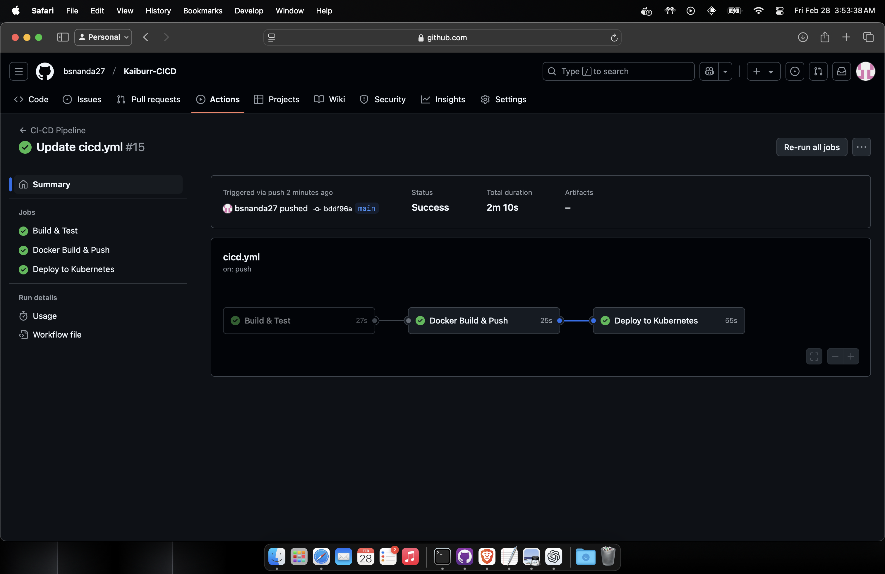
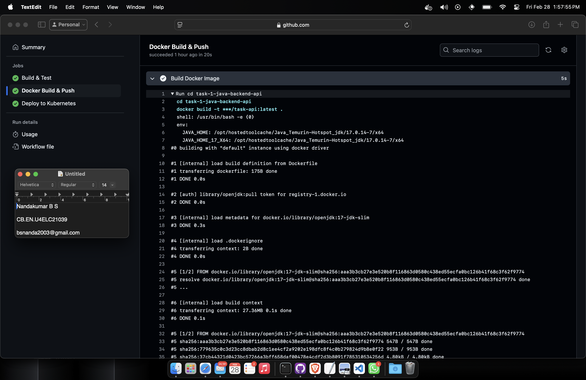
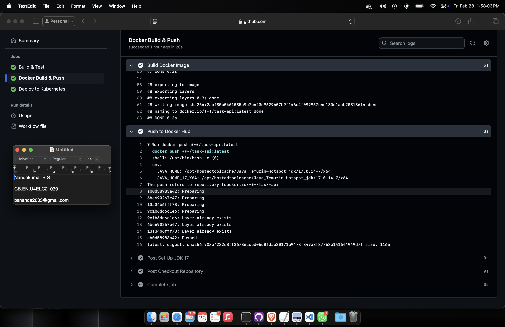
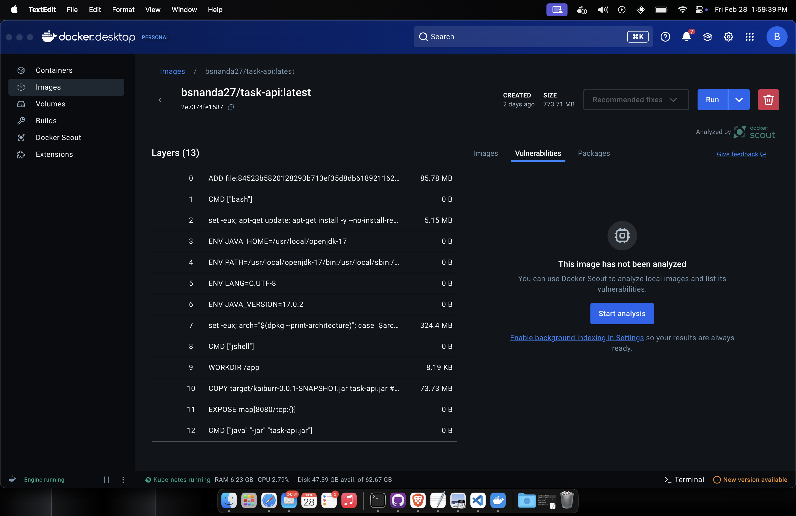

# CI/CD Pipeline for Java Backend API

This repository contains a CI/CD pipeline for building, testing, containerizing, and deploying a Java backend API using GitHub Actions, Docker, and Kubernetes.

## Tools Used

**GitHub Actions**: Automates the build, test, and deployment process.

**Maven**: Builds and manages dependencies for the Java project.

**Docker**: Creates and pushes container images to Docker Hub.

**Kubernetes**: Orchestrates the deployment of the application.

**Minikube**: Runs a local Kubernetes cluster for testing deployments.

**JDK 17**: Java Development Kit used for compiling and running the application.

## Workflow Overview

This pipeline consists of three jobs:

**Build & Test**: Compiles the Java project using Maven and runs unit tests.
**Docker Build & Push**: Builds a Docker image and pushes it to Docker Hub.
**Deploy to Kubernetes**: Deploys the application to a Kubernetes cluster.

## Workflow Triggers

The pipeline is triggered on:
- Pushes to the `main` branch.
- Pull requests targeting the `main` branch.

## Pipeline Stages

### 1. Build and Test

- Checks out the repository.

- Sets up JDK 17.

- Builds the Java project with Maven.

- Runs unit tests.

- Debugs by listing the target directory.

### 2. Docker Build and Push

- Checks out the repository.

- Sets up JDK 17.

- Builds the project with Maven (skipping tests).

- Logs into Docker Hub using stored secrets.

- Builds a Docker image for the application.

- Pushes the Docker image to Docker Hub.

### 3. Deploy to Kubernetes

- Checks out the repository.

- Starts a Minikube cluster.

- Deploys the application using Kubernetes manifests.

- Monitors the deployment rollout.

## Deployment Verification

After deployment, verify the application is running using:

- Check Kubernetes Pods
`kubectl   kubectl get pods`

- Check Logs
`kubectl logs -l app=task-api`

- Check Service
`kubectl get services`

## Conclusion
This pipeline automates the entire process of building, testing, containerizing, and deploying the Task Manager application to a Kubernetes cluster, ensuring a smooth and dependable deployment workflow.

